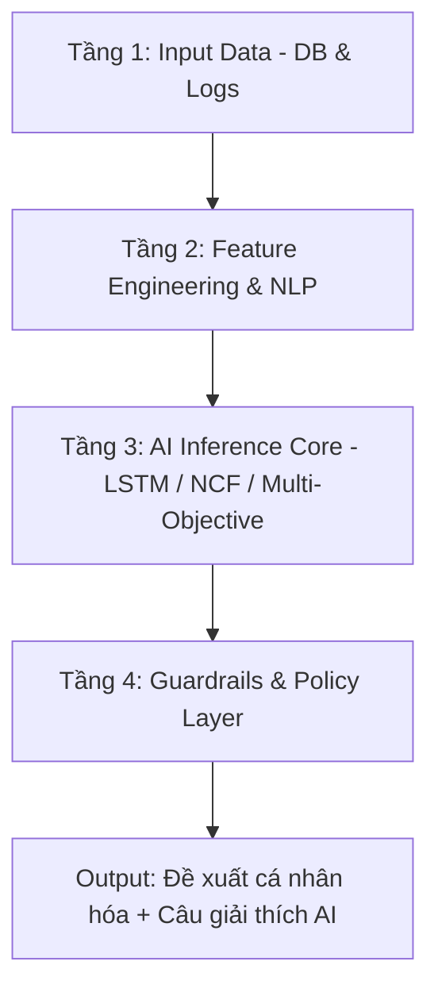
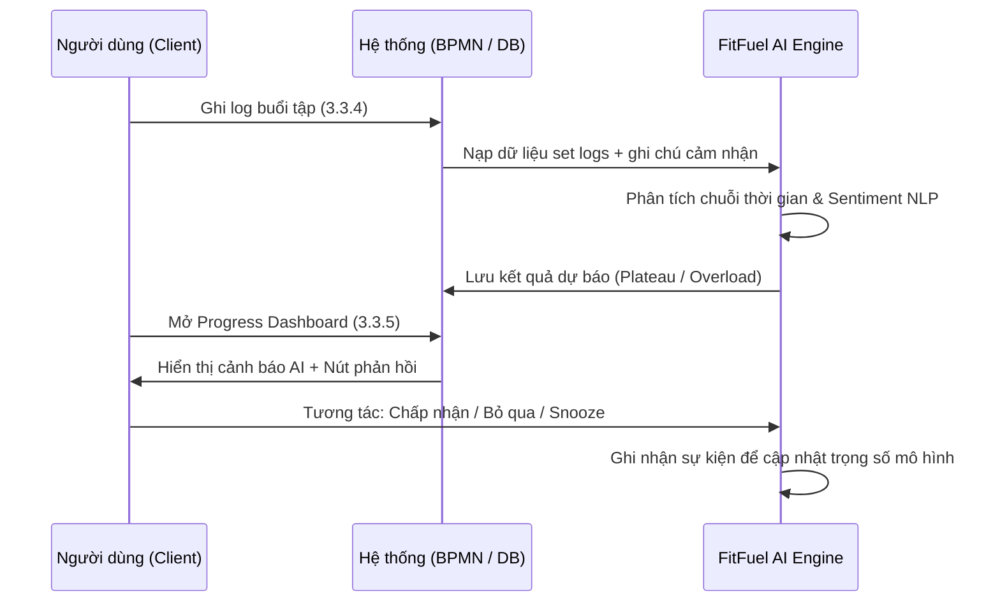

# 15. FITFUEL AI RECOMMENDATION ENGINE SPECIFICATION (ĐỘNG CƠ GỢI Ý DỰA TRÊN AI)

> **Dự án**: FitFuel+  
> **Môn học**: Web Kinh Doanh  
> **Vai trò tài liệu**: Mô tả chi tiết kiến trúc mô hình AI (AI Model), thuật toán và cơ chế xử lý dữ liệu của động cơ gợi ý cá nhân hóa (FitFuel AI Engine). Tài liệu này đóng vai trò là đặc tả kỹ thuật độc lập phục vụ các quy trình nghiệp vụ BPMN trong hệ thống (đặc biệt là quy trình tập luyện 3.3.4 và gợi ý nâng cao/plateau 3.3.5).

========================================================================

## 1. MỤC TIÊU & ĐỊNH VỊ CÔNG NGHỆ

FitFuel AI Engine là **hệ thống trí tuệ nhân tạo dùng chung (Unified AI Service)** có nhiệm vụ cá nhân hóa toàn bộ trải nghiệm người dùng trong hệ sinh thái FitFuel+. Thay vì chỉ sử dụng các câu lệnh điều kiện (IF-ELSE) thô sơ, FitFuel AI Engine kết hợp giữa **mô hình học máy chuỗi thời gian (Sequential ML Models)**, **xử lý ngôn ngữ tự nhiên (NLP)** cho phản hồi định tính, và **lớp lọc ràng buộc cứng (Deterministic Guardrails)** để đưa ra các quyết định chính xác và an toàn nhất.

### Nguyên tắc thiết kế AI (AI System Principles)
- **Explainability (Khả năng giải thích)**: Mọi kết quả từ mô hình AI đều phải đi kèm với một câu lý giải logic hiển thị trực quan cho người dùng (XAI - Explainable AI).
- **Safety First (An toàn là trên hết)**: Lớp Guardrails sẽ chặn mọi đề xuất tăng tải nguy hiểm, ưu tiên giảm tải (Deload) hoặc phục hồi khi phát hiện dấu hiệu quá tải hoặc chấn thương.
- **Data-Driven (Hướng dữ liệu)**: Dữ liệu được ghi nhận từ lịch sử tập luyện (tại quy trình 3.3.4) sẽ là nguồn thức ăn trực tiếp để tinh chỉnh mô hình và đưa ra cảnh báo Plateau/Overload (tại quy trình 3.3.5).

========================================================================

## 2. TỔNG QUAN KIẾN TRÚC MÔ HÌNH AI (4 TẦNG)

Hệ thống xử lý mọi yêu cầu gợi ý thông qua kiến trúc Pipeline 4 tầng chuẩn công nghiệp:



1. **Tầng 1 - Input Data**: Thu thập dữ liệu thời gian thực từ cơ sở dữ liệu (`SET_LOGS`, `WORKOUT_SESSIONS`, `USER_NUTRITION_RESTRICTIONS`, `CHECK_INS`, v.v.).
2. **Tầng 2 - Feature Extraction & NLP**: 
   - Trích xuất đặc trưng chuỗi thời gian (Volume, PR, RPE - Rate of Perceived Exertion).
   - Sử dụng mô hình NLP phân tích sắc thái cảm xúc và từ khóa (Sentiment Analysis & Keyword Tagging) từ các ghi chú cảm nhận định tính của người dùng (ví dụ: *"đau khớp gối"*, *"mệt mỏi"*, *"tạ nhẹ"*).
3. **Tầng 3 - AI Inference Core**: Chạy các thuật toán học máy chuyên biệt (LSTM, Neural Collaborative Filtering, Genetic Algorithms) tùy thuộc vào loại gợi ý.
4. **Tầng 4 - Guardrails & Policy**: Áp dụng các quy tắc nghiệp vụ (Business Rules) và ràng buộc y tế/thiết bị để lọc bỏ các gợi ý không an toàn hoặc không khả thi trước khi trả về Client.

========================================================================

## 3. CHI TIẾT CÁC MÔ HÌNH AI PHÂN HỆ (RE-1 đến RE-5)

| Mã | Tên mô hình AI | Thuật toán cốt lõi | Dữ liệu đầu vào chính | Đầu ra của Mô hình |
|---|---|---|---|---|
| **RE-1** | **Membership Classifier** | XGBoost Classification | Mục tiêu cá nhân, mức ngân sách, lịch sử Trial, khảo sát Onboarding | Đề xuất Gói tập lý tưởng + Lý do khớp mục tiêu |
| **RE-2** | **Workout Generator** | Neural Collaborative Filtering (NCF) + Content-Based Filtering | `MEMBER_PREFERENCES`, mục tiêu, nhóm cơ ưu tiên, thiết bị tại chi nhánh | Danh sách bài tập tối ưu (v1), phân phối độ khó |
| **RE-3** | **Progress & Plateau Predictor** | LSTM (Long Short-Term Memory) + Sentiment NLP | Chuỗi lịch sử tập `SET_LOGS` (3.3.4), RPE, completion rate, ghi chú định tính | Cảnh báo Plateau (đứng tạ) hoặc đề xuất tăng tải (3.3.5) |
| **RE-4** | **Nutrition Optimizer** | Genetic Algorithm + Constraint Satisfaction | Dị ứng thức ăn, Calorie/Macro targets, tồn kho sản phẩm thực tế | Combo bữa ăn/Sản phẩm tối ưu hóa dinh dưỡng |
| **RE-5** | **Churn & Upgrade Predictor** | Random Forest / XGBoost | Tần suất điểm danh `CHECK_INS`, tỷ lệ sử dụng đặc quyền, thời gian gói còn lại | Đề xuất nâng cấp (Upsell) hoặc gia hạn tối ưu |

---

### RE-1: AI Gợi ý gói Membership (Membership Classifier)
- **Thuật toán**: XGBoost Classifier kết hợp trọng số mục tiêu.
- **Logic**: Phân tích hồ sơ khách hàng đầu vào để phân loại nhóm gói phù hợp nhất.
- **Công thức tính điểm khớp**:
  $$Score_{Plan} = w_1 \cdot TargetMatch + w_2 \cdot LevelMatch + w_3 \cdot BenefitMatch + w_4 \cdot BudgetFit$$
- **Giải thích AI (XAI)**: *"Gói VIP được đề xuất vì bạn có mục tiêu tập cùng PT 3 buổi/tuần, ưu tiên khung giờ yên tĩnh và mức ngân sách đề xuất phù hợp."*

---

### RE-2: AI Khởi tạo chương trình tập luyện (Workout Generator)
- **Thuật toán**: Neural Collaborative Filtering (NCF) để dự đoán bài tập yêu thích + Content-based để lọc theo mục tiêu cơ bắp.
- **Ràng buộc thiết bị**: Mô hình thực hiện phép lọc loại trừ (Hard Filtering) dựa trên danh sách thiết bị khả dụng tại chi nhánh hoạt động của Member nhằm tránh gợi ý bài tập không thể thực hiện.
- **Giải thích AI (XAI)**: *"Lịch tập Full Body 3 buổi/tuần được thiết kế riêng cho người mới bắt đầu để tối ưu hóa việc thích nghi cơ bắp mà không gây quá tải."*

---

### RE-3: AI Phân tích tiến độ & Cảnh báo chững tạ (Plateau & Progress Predictor)
> **Mối liên kết chặt chẽ với quy trình 3.3.4 và 3.3.5**

Mô hình này là trái tim của hệ thống tập luyện cá nhân hóa, hoạt động dựa trên luồng dữ liệu liên tục:

```text
[Quy trình 3.3.4: Ghi nhận log hiệp tập + RPE + Ghi chú chấn thương]
                     │
                     ▼ (Lưu vào database)
[AI Engine: Mô hình LSTM phân tích xu hướng tiến bộ chuỗi thời gian]
                     │
                     ▼ (Nếu phát hiện đứng tạ hoặc quá tải)
[Quy trình 3.3.5: Phát ra cảnh báo Plateau/Overload + Gợi ý điều chỉnh bài tập]
```

#### A. Đầu vào mô hình (Thu thập từ 3.3.4):
- Chuỗi $k$ buổi tập gần nhất: mức tạ ($W$), số reps ($R$), chỉ số RPE (Rate of Perceived Exertion từ 1-10).
- Tỷ lệ hoàn thành buổi tập (Completion Rate).
- Dữ liệu văn bản phản hồi cảm nhận sau buổi tập (ví dụ: *"đau vai"*, *"mỏi gối"*, *"rất mệt"*).

#### B. Phân tích chẩn đoán của AI:
1. **Dự báo chững tạ (Plateau Detection)**:
   - Nếu $Volume = W \cdot R$ không tăng trưởng hoặc suy giảm liên tục trong $\ge 4$ buổi tập của cùng một bài tập lớn (ví dụ: Bench Press, Squat) mặc dù Completion Rate $\ge 80\%$.
   - **Chẩn đoán AI**: Cơ bắp đã thích nghi hoàn toàn với kích thích hiện tại. Đề xuất: Thay đổi phạm vi reps (Rep Range), đổi bài tập bổ trợ hoặc áp dụng Progressive Overload chu kỳ mới.
2. **Dự báo quá tải/Nguy cơ chấn thương (Overload / Injury Risk)**:
   - Nếu RPE duy trì ở mức $\ge 9$ trong nhiều buổi liên tục kèm theo phân tích NLP từ ghi chú của người dùng phát hiện các từ khóa liên quan đến đau nhức tiêu cực (`"đau khớp"`, `"nhói"`, `"chấn thương"`).
   - **Chẩn đoán AI**: Cơ thể đang trong trạng thái quá tải (Overtraining). Đề xuất: Bật chế độ Deload (giảm 30% volume) hoặc chèn tuần phục hồi tích cực (Active Recovery).

#### C. Đầu ra mô hình (Hiển thị tại 3.3.5):
- Trả về đối tượng `PROGRESS_ALERTS` chứa phân loại cảnh báo (`plateau`, `overtraining`, `progress_steady`).
- Đề xuất bài tập thay thế tương đương (bài tập cùng nhóm cơ hoạt động nhưng thay đổi góc lực hoặc thiết bị) hoặc điều chỉnh cấu trúc set/rep.
- **Giải thích AI (XAI)**: 
  - *Plateau*: *"Mức tạ Squat của bạn đã chững lại ở mức 60kg trong 4 buổi liên tục dù bạn hoàn thành rất tốt. AI khuyên bạn nên thử đổi sang mức tạ 65kg với số rep giảm từ 10 xuống 6 để kích thích cơ sợi nhanh."*
  - *Deload*: *"Hệ thống ghi nhận bạn có dấu hiệu mỏi cơ kéo dài và đau khớp gối nhẹ qua ghi chú buổi tập. AI khuyến nghị giảm 25% khối lượng tạ tuần này để bảo vệ khớp xương."*

---

### RE-4: AI Tối ưu hóa thực đơn dinh dưỡng (Nutrition Optimizer)
- **Thuật toán**: Genetic Algorithm (Thuật toán di truyền) giải bài toán tối ưu hóa đa mục tiêu: calo đích, tỷ lệ protein/carb/fat mong muốn, ngân sách chi tiêu và loại trừ dị ứng.
- **Ràng buộc cứng (Hard Constraints)**:
  - Loại bỏ hoàn toàn các thực phẩm chứa thành phần dị ứng đã khai báo trong hồ sơ của Member.
  - Chỉ gợi ý các sản phẩm/đồ ăn hiện còn tồn kho thực tế (`INVENTORY > 0`).
- **Giải thích AI (XAI)**: *"Combo ức gà áp chảo và sữa chua Hy Lạp được chọn vì cung cấp đủ 45g protein sau tập, hoàn toàn không chứa lactose theo yêu cầu của bạn."*

---

### RE-5: AI Dự báo vòng đời & Đề xuất gói tập (Lifetime Value & Churn Predictor)
- **Thuật toán**: Random Forest.
- **Logic**: Phân tích tần suất đi tập thực tế (Check-ins) và tỷ lệ tiêu thụ các đặc quyền của gói hiện tại (ví dụ: số buổi tập PT đã dùng, số lần đo InBody) để nhận diện thời điểm vàng cần nâng cấp hoặc gia hạn gói tập.
- **Giải thích AI (XAI)**: *"Bạn đã sử dụng hết 90% số buổi tập với PT cá nhân và có tần suất tập rất đều đặn (4 buổi/tuần). Nâng cấp lên gói VIP sẽ giúp bạn tiết kiệm 20% chi phí PT."*

========================================================================

## 4. QUY TRÌNH KIỂM SOÁT VÀ PHẢN HỒI (AI FEEDBACK LOOP)

Hệ thống FitFuel AI Engine không hoạt động một chiều mà liên tục tự sửa đổi dựa trên tương tác của người dùng:



- **Sự kiện Tương tác (Recommendation Events)**: Mọi thao tác click *Chấp nhận (Accept)*, *Bỏ qua (Dismiss)*, hoặc *Nhắc lại sau (Snooze)* của người dùng đều được ghi lại vào bảng `RECOMMENDATION_EVENTS`.
- **Hệ số tin cậy (Confidence Score)**: Nếu tỷ lệ bỏ qua của một loại gợi ý vượt quá 40%, hệ thống tự động giảm độ nhạy của luật kích hoạt gợi ý đó để tránh gây phiền nhiễu cho người dùng (Ad Fatigue).

========================================================================

## 5. CÁC BIỆN PHÁP BẢO VỆ AN TOÀN (AI GUARDRAILS)

Nhằm đảm bảo an toàn tuyệt đối cho người tập luyện và độ chính xác của hệ thống, FitFuel AI Engine áp đặt các ranh giới kiểm soát bắt buộc:

1. **Ngưỡng an toàn thể chất (Physical Safety Limit)**: Nghiêm cấm tăng mức tạ gợi ý vượt quá 10% so với PR (Personal Record) cũ trong vòng 1 tuần đối với các bài tập phức hợp (Compound Exercises).
2. **Quyền quyết định tối cao của người dùng (User Autonomy)**: AI chỉ đưa ra đề xuất. Hệ thống không được phép tự động thay đổi lịch tập chính thức hoặc tự ý đặt mua sản phẩm dinh dưỡng nếu không có sự xác nhận trực tiếp của người dùng.
3. **Bảo mật thông tin nhạy cảm (Privacy Guard)**: Dữ liệu về cân nặng, chỉ số mỡ và hình ảnh tiến trình tập luyện (Progress Photos) của người dùng được mã hóa đầu cuối và không bao giờ được đưa vào các câu giải thích AI công khai hoặc chia sẻ ra cộng đồng khi chưa được cấp quyền cụ thể.

========================================================================
*Tài liệu đặc tả kiến trúc FitFuel AI Engine - Phiên bản nâng cấp phục vụ Đồ án Hệ thống Web Kinh Doanh Thể hình.*
