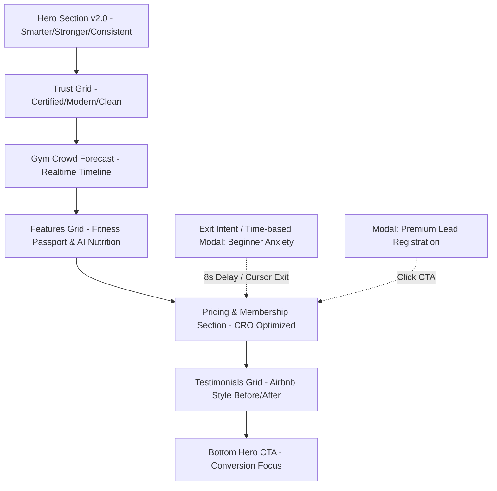

# 17. Landing Page Design Specification (FitFuel V2.0)
*(Apple + Stripe + Airbnb + Notion Quality)*

> **Dự án**: FitFuel+  
> **Tác giả**: Senior Product Designer  
> **Cập nhật**: 08/07/2026  
> **Mục tiêu**: Nâng cấp Landing Page FitFuel từ phiên bản 1.0 lên 2.0. Tập trung tối ưu hóa tỷ lệ chuyển đổi (CRO), giảm bớt sự lo ngại của người mới bắt đầu (Beginner Anxiety), tăng tính thuyết phục cảm xúc, và duy trì tính nguyên bản của nhận diện thương hiệu FitFuel+.

---

## I. TỔNG QUAN HỆ THỐNG PHONG CÁCH & BẢNG MÀU (PRESERVED BRAND IDENTITY)

Để không phá vỡ cấu trúc CSS hiện tại trong `index.css`, phiên bản 2.0 kế thừa và tối ưu hóa các Token màu sắc và tiện ích sau:

| Token | Giá trị HEX | Vai trò trong giao diện V2.0 |
|---|---|---|
| `--color-brand-dark` | `#18181B` | Màu chữ chính, nền thẻ cao cấp, viền mảnh tạo khối. |
| `--color-orange` | `#FF5722` | Nút CTA chính (Primary Call-to-Action), Huy hiệu nổi bật (Badge), Điểm nhấn đồ thị. |
| `--color-brand-light` | `#6EC1E4` | Glow (Độ sáng mờ), Nền mờ (Glassmorphism), Trạng thái an toàn/thoải mái. |
| `--color-brand-white` | `#FFFFFF` | Nền trang chính, thẻ thông tin phụ. |
| `glass` | *Utility* | Nền mờ kính 65% White + Blur 16px tạo chiều sâu cho bảng giá & popup. |
| `premium-card` | *Utility* | Hiệu ứng 3D nghiêng nhẹ và đổ bóng khi di chuột (Hover tilt & shadow). |

---

## II. CHI TIẾT CẤU TRÚC LAYOUT VÀ THÀNH PHẦN (V2.0 COMPONENT HIERARCHY)



---

## III. CHI TIẾT THIẾT KẾ CÁC PHÂN ĐOẠN (SECTION-BY-SECTION DESIGN & COPYWRITING)

### 1. Hero Section (Nâng cấp cảm xúc và Độ tin cậy)

*   **Ý tưởng UI/UX**: Tăng tính tương phản cho phần chữ đè lên ảnh nền. Bổ sung các "Floating Statistics" (Thống kê bay lơ lửng) dạng Glassmorphism hai bên để tạo hiệu ứng chiều sâu 3D (parallax) khi cuộn.
*   **Component Hierarchy**:
    ```
    [Hero Container (Relative)]
      ├── Background Image (Dark overlay gradient)
      ├── Content Container (Max-width 7xl)
      │     ├── Badge: "⚡ Hệ Sinh Thái Thể Hình Toàn Diện"
      │     ├── Typography H1: "Tập Thông Minh. Khỏe Mạnh Hơn. Kỷ Luật Hơn."
      │     ├── Supporting text (Join thousands...)
      │     └── CTA Button Group: [Đăng ký Trải Nghiệm] - [Xem Bảng Giá]
      └── Floating Stats Card (Absolute - Desktop only)
            ├── Card 1: 10,000+ Hội viên (Glow Orange)
            └── Card 2: 4.9★ Đánh giá (Glow Blue)
    ```

*   **Copywriting**:
    *   *Headline H1*: `Tập Thông Minh. Khỏe Mạnh Hơn. Kỷ Luật Hơn.`
    *   *Sub-headline*: `Không còn những buổi tập mơ hồ. Nhận giáo án AI cá nhân hóa, theo dõi tiến trình thực tế và đặt thực đơn dinh dưỡng chuẩn xác cùng FitFuel+.`
    *   *Primary CTA*: `Bắt đầu tập thử miễn phí`
    *   *Secondary CTA*: `Xem các gói hội viên`

---

### 2. Trust Section (Thẻ năng lực cao cấp kiểu Stripe)

*   **Ý tưởng UI/UX**: Thay thế các biểu tượng đơn giản bằng các khối thẻ tính năng tinh xảo (Premium Grid). Sử dụng hiệu ứng hover làm nổi bật đường viền gradient (Border-glow).
*   **Gồm 6 thẻ cốt lõi**:
    1.  **Huấn luyện viên Đạt Chuẩn**: 100% PT có chứng chỉ quốc tế (NASM, ISSA).
    2.  **Thiết bị Đẳng Cấp**: Máy tập nhập khẩu hiện đại, hỗ trợ đo tracking thông minh.
    3.  **Hội viên Linh Hoạt**: Bảo lưu hoặc nâng cấp gói trực tuyến không cần thủ tục giấy tờ.
    4.  **Không gian Sạch Sẽ**: Phòng tập khử khuẩn định kỳ mỗi 2 giờ, hệ thống lọc khí tươi.
    5.  **Hỗ trợ 24/7**: Đội ngũ hỗ trợ và AI FitBot luôn đồng hành giải đáp thắc mắc.
    6.  **Cam kết Hài Lòng**: Hoàn tiền trong vòng 7 ngày nếu không hài lòng với dịch vụ.

---

### 3. Gym Crowd Forecast (Đồ thị dự báo mật độ phòng tập)
*Mục tiêu CRO: Xóa bỏ nỗi sợ phòng gym quá đông của người mới và dân văn phòng.*

*   **Ý tưởng UI/UX**: Hiển thị dòng thời gian trực quan của một ngày bình thường tại phòng tập. Sử dụng các thanh đo độ rộng (ProgressBar) với màu sắc chuyển trạng thái (Green = Thoải mái, Yellow = Trung bình, Red = Cao điểm).

#### Minh họa giao diện (Timeline Component):

| Khung giờ | Mức độ | Thanh trực quan | Trạng thái hiển thị |
|---|---|---|---|
| **06:00 - 08:00** | Cao điểm | `██████████ 85%` | 🔴 Bận rộn (Peak) |
| **09:00 - 12:00** | Bình thường | `█████ 45%` | 🟡 Trung bình (Moderate) |
| **13:00 - 16:00** | Thấp điểm | `██ 15%` | 🟢 Yên tĩnh (Quiet) |
| **17:00 - 20:00** | Cao điểm | `███████████ 95%` | 🔴 Rất đông (Peak) |
| **20:00 - 22:00** | Thoải mái | `████ 30%` | 🟢 Dễ chịu (Comfortable) |

> **💡 Khuyến nghị dành cho người mới**:  
> **Khung giờ vàng: 13:00 - 16:00 (Yên tĩnh)**  
> *Lợi ích*: Bạn có không gian riêng tư tối đa, thoải mái làm quen với máy tập dưới sự hướng dẫn của huấn luyện viên mà không lo bị dòm ngó hay phải xếp hàng đợi máy.

---

### 4. Pricing Section (Tối ưu hóa bảng giá chuyển đổi)

*   **Ý tưởng UI/UX**: Áp dụng thiết kế thẻ so sánh song song với phân cấp thị giác cực mạnh.
*   **Chiến thuật kích thích (Nudges)**:
    *   **Gói Năm (Annual Plan)**: Nhãn `💎 Đáng Giá Nhất` (Best Value) màu Cam chói. Làm nổi bật dòng chữ tiết kiệm **50%** so với đóng hàng tháng.
    *   **Gói Tháng (Monthly Plan)**: Nhãn `🔥 Phổ Biến` (Most Popular) màu Neon Blue. Ưu đãi: Giảm **30% cho tháng đầu tiên**.

*   **Copywriting & Price Display**:
    *   **Gói Tháng**:
        *   *Giá gốc*: `~~799.000đ~~`
        *   *Giá khuyến mãi*: `559.000đ` / tháng đầu tiên (Gia hạn tự động `799.000đ/tháng`).
        *   *CTA*: `Đăng Ký Gói Tháng` (Nền Glass, viền Cam).
    *   **Gói Năm**:
        *   *Giá hiển thị*: `Chỉ 4.800.000đ` / năm (Tương đương `400.000đ/tháng`).
        *   *Nhãn tiết kiệm*: `Tiết kiệm 50%` (Tương đương tặng 6 tháng tập).
        *   *CTA*: `Mua Gói Năm - Tiết Kiệm 50%` (Nền Cam đậm `#FF5722`, bóng mờ chuyển động).

---

### 5. Beginner Anxiety Popup (Modal giải tỏa áp lực tâm lý)
*Trigger: Xuất hiện tự động sau 8 giây ở trang, hoặc khi người dùng di chuột chuẩn bị tắt tab (Exit Intent).*

*   **Thiết kế UI/UX**: Sử dụng khung Glassmorphic mờ ảo cao cấp. Bo góc rộng 24px. Tránh sử dụng ảnh chụp cơ bắp cuồn cuộn làm người dùng sợ; thay vào đó là icon vector tối giản, nét thanh mảnh (Notion/Apple style).
*   **Nội dung**:
    *   *Headline*: `Bạn cảm thấy e ngại trong buổi tập đầu tiên?`
    *   *Body*: `Đừng lo lắng. 85% hội viên của FitFuel+ đều bắt đầu từ con số 0. Chúng tôi thiết kế lộ trình riêng để bạn hòa nhập dễ dàng nhất:`
        *   `✔ Huấn luyện viên kèm cặp sát sao 1:1 trong tuần đầu.`
        *   `✔ Khu vực tập riêng biệt, không phán xét (No-judgment zone).`
        *   `✔ Các nhóm nhỏ chỉ dành riêng cho người mới bắt đầu.`
    *   *CTA chính*: `Nhận vé tập thử miễn phí`
    *   *CTA phụ*: `Để tôi xem thêm` (Làm mờ/Chữ thường).

---

### 6. Registration Popup (Modal Đăng Ký Cao Cấp)

*   **Thiết kế UI/UX**: Form điền thông tin tối giản, các trường nhập liệu rộng (chiều cao tối thiểu 48px để dễ chạm trên điện thoại). Bổ sung cột bên trái (hoặc phía trên cùng trên mobile) chứa các "Trust Badges" để củng cố quyết định.
*   **Trình bày Component**:
    ```
    ┌────────────────────────────────────────────────────────┐
    │          BẮT ĐẦU HÀNH TRÌNH THỂ HÌNH CỦA BẠN           │
    │  ⭐⭐⭐⭐⭐ Đánh giá 4.9★ bởi 5,000+ hội viên năng động    │
    ├──────────────────────────┬─────────────────────────────┤
    │ Quyền lợi của bạn:       │ Nhập thông tin đăng ký:     │
    │ 🎁 Đo chỉ số cơ thể free │ 👤 Họ và tên                │
    │ 🎁 AI thiết kế giáo án   │ 📞 Số điện thoại (Nhận OTP) │
    │ 🎁 1 buổi tập thử 1-1    │ ✉ Địa chỉ Email             │
    │                          │ 📅 Khung giờ bạn muốn tập   │
    │ * Không yêu cầu thẻ tín  ├─────────────────────────────┤
    │   dụng khi đăng ký thử.  │   [ KÍCH HOẠT TẬP THỬ MIỄN PHÍ ] │
    └──────────────────────────┴─────────────────────────────┘
    ```

---

### 7. Social Proof (Đánh giá thực tế từ hội viên)

*   **Thiết kế UI/UX**: Bố cục dạng lưới (Masonry Grid) như Airbnb. Mỗi đánh giá hiển thị thẻ so sánh nhỏ **Before/After** (nếu hội viên cho phép hiển thị riêng tư) để tăng tính chân thực trực quan.
*   **Copywriting mẫu**:
    > *"Tôi từng sợ tiếng kim loại va chạm và những ánh nhìn ở phòng gym. Nhờ FitFuel+, tôi tập ở khung giờ vắng khách (14h chiều) theo biểu đồ mật độ, kết hợp giáo án AI deload thông minh. Tôi đã giảm 12kg sau 6 tháng một cách nhẹ nhàng."*  
    > ⭐⭐⭐⭐⭐  
    > **Minh Anh** - *Nhân viên Văn phòng (26 tuổi)*

---

## IV. ĐỀ XUẤT HIỆU ỨNG CHUYỂN ĐỘNG (MICRO-INTERACTIONS & ANIMATIONS)

Để trang web sống động và mang lại cảm giác công nghệ cao (Notion/Linear), áp dụng các thuộc tính thư viện `framer-motion`:

1.  **Card Elevation & Tilt (Hiệu ứng thẻ 3D)**:
    Khi hover vào các thẻ tính năng hoặc thẻ giá, áp dụng `whileHover={{ y: -6, rotateX: 1, rotateY: -1 }}` kết hợp viền sáng chạy qua (Shimmer effect).
2.  **Smooth Section Fade-In (Hiện dần khi cuộn)**:
    Sử dụng class `.scroll-reveal` đã có sẵn trong `index.css`. Khi cấu phần đi vào khung nhìn (viewport), kích hoạt class `.scroll-reveal-visible` với độ trễ (`transition-delay: 150ms`).
3.  **Hộp thoại Popup mượt mà (AnimatePresence)**:
    Khi đóng mở popup, sử dụng:
    *   *Mở*: `initial={{ scale: 0.95, opacity: 0 }}` -> `animate={{ scale: 1, opacity: 1 }}` với thời lượng `200ms` (cubic-bezier).
    *   *Đóng*: `exit={{ scale: 0.98, opacity: 0 }}`.

---

## V. TỐI ƯU HÓA TRÊN THIẾT BỊ DI ĐỘNG (MOBILE RESPONSIVENESS & ACCESSIBILITY)

*   **Bảng giá cuộn ngang (Horizontal Swiping)**: Trên màn hình dưới 640px (Mobile), chuyển đổi bảng giá 2 cột thành dạng thẻ trượt ngang (Swiper/Carousel) có hiển thị chấm điều hướng nhỏ bên dưới để tránh kéo dài trang quá mức.
*   **Tăng kích thước chạm (Tap Targets)**: Tất cả các nút bấm, đặc biệt là nút `Claim My Free Trial` phải có chiều cao tối thiểu 52px và khoảng cách an toàn với các phần tử khác tối thiểu 12px để tránh chạm nhầm.
*   **Độ tương phản chữ**: Đảm bảo contrast tối thiểu 4.5:1. Sử dụng font chữ Inter với thuộc tính `antialiased` để chữ sắc nét trên màn hình Retina/OLED của điện thoại.
