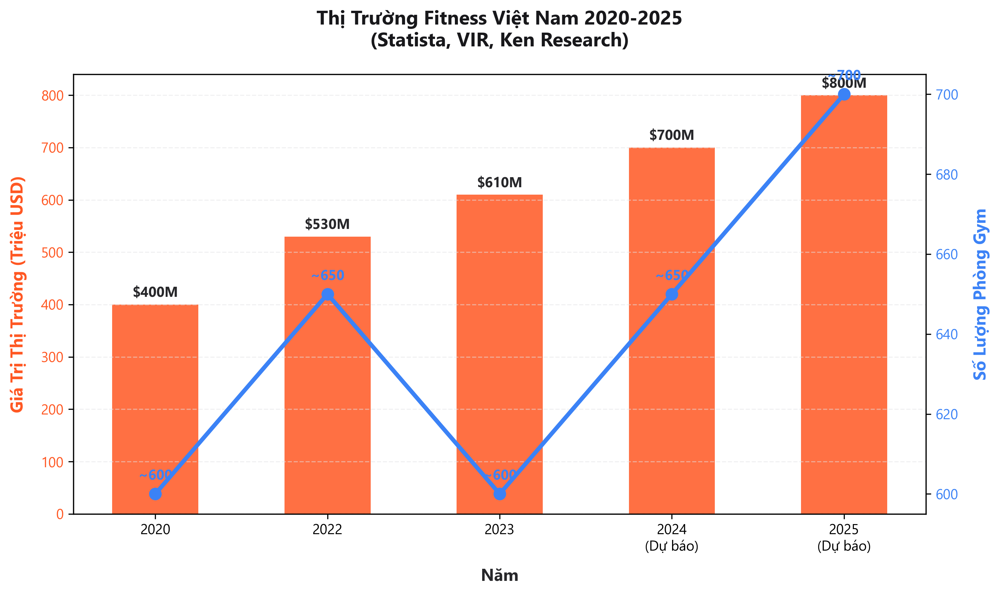
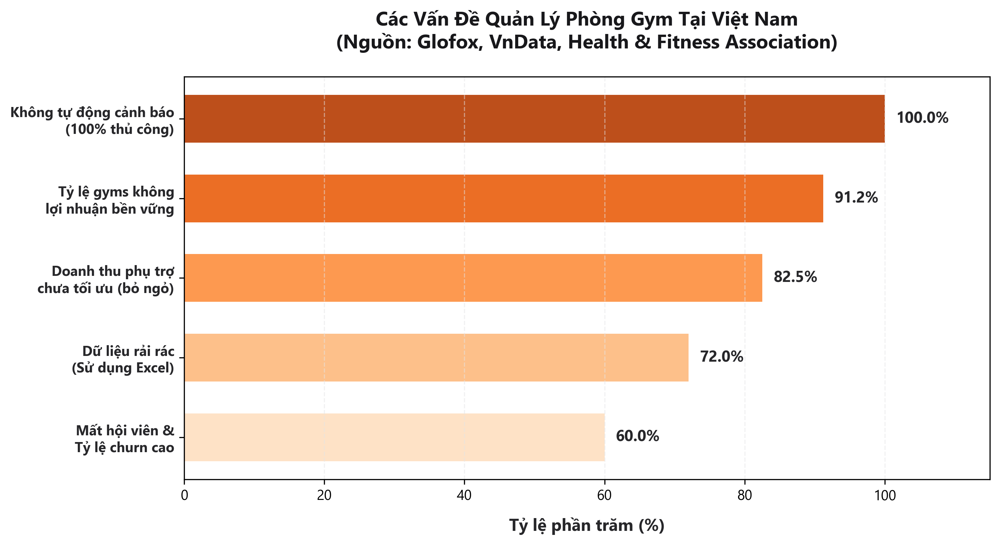
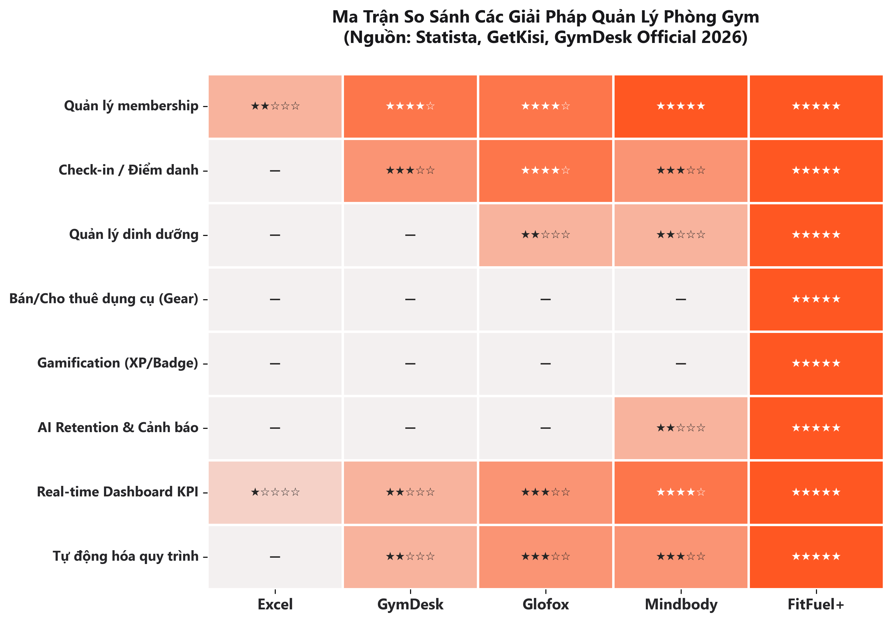

# Mở đầu

Nhu cầu chăm sóc sức khỏe và rèn luyện thể chất đang thay đổi mạnh mẽ trong bối cảnh số hóa. Người dùng hiện nay không chỉ muốn tập luyện mà còn cần quản lý dinh dưỡng, giám sát chỉ số sức khỏe và tham gia cộng đồng fitness – tất cả trên cùng một nền tảng. Tuy nhiên, phần lớn các giải pháp hiện có chỉ giải quyết từng nhu cầu riêng lẻ, dẫn đến trải nghiệm phân mảnh.

Từ thực tế đó, nhóm phát triển đồ án **"FitFuel+"** – một nền tảng quản lý phòng gym toàn diện tích hợp quản lý luyện tập, dinh dưỡng, dụng cụ thể thao, gamification và AI Retention trên cùng một hệ thống. Đồ án vận dụng các kiến thức về phân tích hệ thống, thiết kế CSDL, UX/UI và phát triển ứng dụng web nhằm tạo ra sản phẩm có tính ứng dụng cao trong lĩnh vực fitness.

# Lời cảm ơn

**LỜI CẢM ƠN**

Nhóm xin gửi lời cảm ơn chân thành đến Trường Đại học Kinh tế - Luật, Đại học Quốc gia Thành phố Hồ Chí Minh cùng quý thầy cô Khoa Hệ thống Thông tin đã tạo điều kiện học tập và nghiên cứu. Những kiến thức về phân tích và thiết kế hệ thống, cơ sở dữ liệu đã trở thành nền tảng quan trọng giúp chúng em hoàn thiện đồ án này.

Đặc biệt, nhóm xin bày tỏ lòng biết ơn sâu sắc đến giảng viên hướng dẫn đã tận tình hỗ trợ, định hướng và đóng góp nhiều ý kiến quý báu trong suốt quá trình thực hiện đồ án **"FitFuel+"**.

Mặc dù đã nỗ lực hết mình, do kiến thức và kinh nghiệm còn hạn chế nên đồ án khó tránh khỏi thiếu sót. Nhóm rất mong nhận được ý kiến đóng góp từ quý thầy cô để tiếp tục hoàn thiện trong tương lai.

Nhóm xin kính chúc quý thầy cô luôn dồi dào sức khỏe, hạnh phúc và thành công trong sự nghiệp.

**Nhóm sinh viên thực hiện**

# Tóm tắt

# **TÓM TẮT ĐỒ ÁN**

Đồ án **"FitFuel+"** xây dựng hệ thống quản lý phòng tập gym toàn diện theo mô hình Single-Tenant, giải quyết bài toán vận hành rời rạc mà phần lớn phòng gym vừa và nhỏ tại Việt Nam đang gặp phải. Hệ thống tích hợp tám phân hệ: Account Management, Gym Tracking, Membership Lifecycle, Nutrition Management, Gear Marketplace & Rental, Gamification, Payment & FitCoin và AI Retention & Reporting.

Về công nghệ, FitFuel+ sử dụng kiến trúc phân tách Frontend (React) – Backend (FastAPI) với cơ sở dữ liệu PostgreSQL. Nhóm vận dụng các phương pháp mô hình hóa Use Case, BPMN, DFD và ERD để chuyển hóa yêu cầu nghiệp vụ thành thiết kế kỹ thuật.

Điểm khác biệt cốt lõi nằm ở khả năng kết nối đồng bộ giữa quản lý vận hành (membership, check-in) với nghiệp vụ gia tăng giá trị (dinh dưỡng, dụng cụ, gamification) và cơ chế giữ chân hội viên thông minh (AI Retention), giúp chuyển đổi dữ liệu thành hành động chăm sóc khách hàng cụ thể.

# Câu chuyện thương hiệu

Anh Hùng – chủ phòng gym quy mô vừa tại TP.HCM – quản lý hội viên bằng Excel và sổ ghi chép. Dữ liệu về gói tập, doanh thu dinh dưỡng, cho thuê dụng cụ nằm rải rác. Khi quy mô mở rộng, anh không biết ai sắp hết hạn, sản phẩm nào bán chạy, doanh thu đến từ đâu. Hội viên hết hạn mà nhân viên không kịp liên hệ gia hạn – mất khách mà không nhận ra.

Dữ liệu vận hành ngày càng nhiều nhưng chưa được khai thác. Nhân viên không biết ưu tiên chăm sóc ai, ai có khả năng gia hạn, ai sắp rời bỏ. Báo cáo chỉ thống kê số liệu, chưa đưa ra hành động cụ thể.

Đây là thực trạng chung của hàng ngàn phòng gym nhỏ và vừa tại Việt Nam. FitFuel+ được phát triển để giải quyết bài toán này – một hệ thống quản lý toàn diện tích hợp quản lý hội viên, dinh dưỡng, dụng cụ, gym tracking, gamification và AI Retention trong cùng một nền tảng.

# 1.1. Bối cảnh thực tế

Xu hướng sống khỏe (healthy lifestyle) đẩy nhu cầu tập gym tại Việt Nam tăng mạnh. Thị trường fitness phát triển bền vững với tốc độ 14%/năm:

**📊 Chart 1: Thị Trường Fitness Việt Nam 2020-2025 (Statista)**

| Năm | Giá Trị Thị Trường | Số Phòng Gym |
|---|---|---|
| 2020 | $400 triệu | ~600 |
| 2022 | ~$530 triệu | ~600-700 |
| 2023 | ~$610 triệu | ~600 |
| 2024 (dự báo) | ~$700 triệu | ~650 |
| 2025 (dự báo) | ~$800 triệu | ~700 |
| **Tốc độ tăng** | **14%/năm** | **Tăng chậm nhưng ổn định** |

*Nguồn: Statista, VIR, Ken Research (2025)*

Tuy nhiên, phần lớn phòng gym vừa và nhỏ vẫn quản lý thủ công. Dữ liệu hội viên, doanh thu, dinh dưỡng và tài sản cho thuê nằm rải rác trên Excel, sổ tay và tin nhắn. Lễ tân mất 30-45 giây cho mỗi lượt check-in. Hội viên sắp hết hạn không được nhắc nhở. Dịch vụ phụ trợ (dinh dưỡng, dụng cụ) chưa được kiểm soát tồn kho.

Thực trạng này cho thấy nhu cầu cấp thiết về một nền tảng quản lý tập trung – số hóa toàn bộ hoạt động vận hành, tự động hóa cảnh báo chăm sóc khách hàng và khai thác dữ liệu để hỗ trợ ra quyết định kinh doanh. Đó là cơ sở để FitFuel+ được đề xuất.

# 1.2. Đặt vấn đề

Quản lý thủ công bộc lộ nhiều hạn chế khi quy mô phòng tập mở rộng. Các vấn đề cụ thể:

**📊 Chart 2: Vấn Đề Quản Lý Phòng Gym Việt Nam (Từ Thực Tiễn & Báo Cáo Ngành)**

| Vấn Đề | Chỉ Số | Ảnh Hưởng |
|---|:---:|---|
| **Tỷ lệ gyms không lợi nhuận bền vững** | **91.2%** | Boutique fitness studios không đạt break-even, buộc phải đóng cửa (Glofox 2024) |
| **Mất hội viên & churn cao** | **35-45% gia hạn** | Không biết member nào sắp rời đi, phải theo dõi thủ công |
| **Doanh thu phụ trợ ít khai thác** | **Chỉ 15-20%** | Nutrition & Gear chỉ chiếm nhỏ, mặc dù tiềm năng lên đến 40% |
| **Không tự động hóa cảnh báo** | **100% thủ công** | Hội viên sắp hết hạn không được nhắc nhở, phụ thuộc vào nhân viên |
| **Dữ liệu rải rác, khó phân tích** | **72% dùng Excel** | Không biết member nào có nguy cơ churn, ai khả năng upsell |

*Nguồn: Glofox, VnData, Health & Fitness Association (2024-2025)*
*Thực tiễn: 91.2% gyms không lợi nhuận, các chain lớn như Fit24 phải đóng cửa*

Cụ thể, có năm vấn đề nghiệp vụ cần giải quyết:

- **Quản lý vòng đời hội viên lỏng lẻo**: Không có cảnh báo tự động khi hội viên sắp hết hạn hoặc ngừng đi tập lâu ngày, dẫn đến mất khách mà không can thiệp kịp.
- **Doanh thu phụ trợ chưa khai thác**: Bán dinh dưỡng và cho thuê dụng cụ ghi chép bằng sổ tay, không kiểm soát được tồn kho và doanh thu từng nhóm dịch vụ.
- **Dữ liệu không chuyển thành hành động**: Dữ liệu check-in, mua sản phẩm, lịch sử tập luyện có sẵn nhưng chỉ dừng ở thống kê, chưa hỗ trợ ra quyết định.
- **Thiếu động lực tập luyện**: Hội viên bỏ tập sau 1-2 tháng do thiếu mục tiêu rõ ràng và sự khích lệ.
- **Check-in chậm, thủ tục rườm rà**: Lễ tân mất nhiều thời gian xác nhận thẻ thủ công, gây ùn tắc giờ cao điểm.

Từ đó, bài toán đặt ra: xây dựng một nền tảng tích hợp vừa quản lý vận hành, vừa tối ưu doanh thu phụ trợ, vừa ứng dụng công nghệ giữ chân hội viên.

# 1.3. Mục tiêu dự án

### **1.3.1. Mục tiêu kinh doanh**

FitFuel+ số hóa toàn bộ quy trình vận hành phòng gym trong một nền tảng thống nhất, thay vì sử dụng nhiều công cụ rời rạc. Mục tiêu cụ thể:

- Quản lý tập trung dữ liệu hội viên, gói tập, check-in, giao dịch mua hàng và cho thuê dụng cụ trên cùng một hệ thống.
- Tối ưu doanh thu phụ trợ từ dinh dưỡng và dụng cụ thông qua quản lý tồn kho tự động và theo dõi doanh thu theo nhóm sản phẩm.
- Giữ chân hội viên bằng cơ chế AI Retention: tự động cảnh báo hội viên sắp hết hạn, giảm tần suất đi tập hoặc có nguy cơ rời bỏ để nhân viên chủ động chăm sóc.
- Tăng trải nghiệm hội viên qua gamification: XP, Badge, Streak và bảng xếp hạng gắn liền với lịch sử tập luyện thực tế.

### **1.3.2. Mục tiêu hệ thống**

FitFuel+ được thiết kế với các chỉ tiêu kỹ thuật cụ thể:

- **Membership là thành phần trung tâm**: Đăng ký, gia hạn, nâng cấp, bảo lưu – toàn bộ vòng đời hội viên được quản lý tập trung và đồng bộ.
- **Gym Tracking & Fitness Passport**: Hội viên ghi nhận buổi tập, theo dõi chỉ số cơ thể, quan sát tiến trình phát triển theo thời gian.
- **Kinh doanh nội bộ**: Quản lý tồn kho dinh dưỡng, bán hàng tại quầy, cho thuê dụng cụ, liên kết giao dịch với hồ sơ hội viên.
- **AI Retention & Dashboard KPI**: Cung cấp danh sách hành động cụ thể (ai cần chăm sóc, ai sắp rời bỏ), trực quan hóa doanh thu, hội viên, tồn kho theo thời gian thực.
- **Tối ưu UX**: Check-in dưới 10 giây bằng QR Code, ghi nhận buổi tập nhanh trên cả mobile và desktop.

# 1.4. Phạm vi đề tài

Hệ thống gồm tám phân hệ liên kết chặt chẽ:

- **Module 1 – Account Management**: Đăng ký, đăng nhập, hồ sơ cá nhân và Fitness Passport.
- **Module 2 – Gym Tracking**: Check-in QR Code, ghi nhận buổi tập, thống kê lịch sử và trực quan hóa tiến trình.
- **Module 3 – Membership Lifecycle Management**: Quản lý toàn bộ vòng đời hội viên (đăng ký → gia hạn → nâng cấp → bảo lưu → tạm ngưng). Tự động cảnh báo hội viên sắp hết hạn hoặc không hoạt động.
- **Module 4 – Nutrition Management**: Quản lý danh mục sản phẩm dinh dưỡng, tồn kho, bán hàng tại quầy, thống kê doanh thu theo nhóm.
- **Module 5 – Gear Marketplace & Rental**: Bán/cho thuê dụng cụ, quản lý đặt cọc, theo dõi thời hạn trả và tính phí phạt. Hỗ trợ Guest OTP Checkout cho khách vãng lai.
- **Module 6 – Gamification**: Tích lũy XP, nhận Badge, Streak liên tục và thử thách luyện tập. Thành tích lưu trong Fitness Passport.
- **Module 7 – Payment & FitCoin**: Thanh toán mô phỏng (sandbox), quản lý điểm thưởng FitCoin.
- **Module 8 – AI Retention & Reporting**: Phân tích dữ liệu vận hành, cảnh báo hội viên nguy cơ churn, Dashboard KPI trực quan.

Hệ thống xây dựng theo mô hình **Single-Tenant**, phục vụ một phòng gym duy nhất. Nằm ngoài phạm vi: quản lý chuỗi phòng tập, tích hợp thiết bị đeo thông minh, livestream, mạng xã hội nội bộ và thanh toán thực tế.

# 1.5. Thông tin thương hiệu

Tên gọi **"FitFuel+"**: **"Fit"** – rèn luyện thể chất, **"Fuel"** – năng lượng duy trì luyện tập, **"+"** – kết nối và mở rộng giá trị thông qua công nghệ.

Slogan: **"Train Smart. Manage Better. Grow Stronger."**
- *Train Smart*: Hội viên tập luyện khoa học nhờ tracking và gamification.
- *Manage Better*: Chủ gym quản lý hiệu quả nhờ dữ liệu tập trung và AI.
- *Grow Stronger*: Phòng tập phát triển bền vững nhờ tối ưu trải nghiệm và doanh thu.

**Tầm nhìn**: Giải pháp quản lý gym hiện đại, phổ biến nhất cho phân khúc phòng tập vừa và nhỏ tại Việt Nam.

**Sứ mệnh**: Giúp chủ phòng tập số hóa vận hành, chuyển đổi dữ liệu thành hành động chăm sóc khách hàng cụ thể, gia tăng doanh thu và duy trì hội viên.

**Đối tượng mục tiêu**: Chủ phòng gym, quản lý vận hành, nhân viên lễ tân và hội viên tập luyện.

# 1.6. Phân tích đối thủ cạnh tranh

Thị trường đã có nhiều giải pháp quản lý phòng tập, nhưng phần lớn chỉ giải quyết bài toán riêng lẻ. Nhóm khảo sát và so sánh FitFuel+ với các giải pháp phổ biến:

**📊 Chart 3: So Sánh Phần Mềm Quản Lý Gym - FitFuel+ vs Đối Thủ (Statista, GetKisi 2026)**

| **Tính Năng** | **Excel** | **GymDesk** | **Glofox** | **Mindbody** | **FitFuel+** |
|---|:---:|:---:|:---:|:---:|:---:|
| **Quản lý membership** | ★★☆☆☆ | ★★★★☆ | ★★★★☆ | ★★★★★ | ★★★★★ |
| **Check-in/Attendance** | — | ★★★☆☆ | ★★★★☆ | ★★★☆☆ | ★★★★★ |
| **Nutrition Management** | — | — | ★★☆☆☆ | ★★☆☆☆ | ★★★★★ |
| **Gear Rental** | — | — | — | — | ★★★★★ |
| **Gamification (XP/Badge)** | — | — | — | — | ★★★★★ |
| **AI Retention & Alerts** | — | — | — | ★★☆☆☆ | ★★★★★ |
| **Real-time Dashboard** | ★☆☆☆☆ | ★★☆☆☆ | ★★★☆☆ | ★★★★☆ | ★★★★★ |
| **Tự động hóa** | — | ★★☆☆☆ | ★★★☆☆ | ★★★☆☆ | ★★★★★ |
| **Chi phí** | **0đ** | **$75/tháng** | **~$110/tháng** | **$139/tháng** | **~1-2M/tháng** |
| **Focused For** | Thủ công | CrossFit/BJJ | Boutique Fitness | Multi-service | **Toàn diện Gym** |

*Nguồn: GetKisi (2026), GymDesk Official, Statista (2026)*

Nhận xét:

- **Excel**: Chi phí 0đ nhưng không tự động hóa, không cảnh báo, không phân tích – chỉ phù hợp quy mô dưới 50 hội viên.
- **GymDesk & Glofox**: Hỗ trợ tốt membership nhưng chi phí cao ($75-110/tháng), thiếu mảng dinh dưỡng, dụng cụ và gamification.
- **Mindbody**: Đa dịch vụ nhưng quá đắt ($139+/tháng), giao diện phức tạp, không phù hợp phòng gym vừa và nhỏ Việt Nam.
- **FitFuel+**: Giải pháp duy nhất cover toàn bộ vòng đời hội viên + doanh thu phụ trợ + gamification + AI Retention, với chi phí phù hợp thị trường Việt Nam (~1-2M/tháng).

# 1.7. Điểm khác biệt và tính mới của đề tài

So với các giải pháp hiện có, FitFuel+ có bốn điểm cải tiến cốt lõi:

- **Thứ nhất, tích hợp quản lý cốt lõi và thương mại phụ trợ**: GymDesk và Glofox bỏ ngỏ mảng cho thuê dụng cụ và bán dinh dưỡng tại quầy. FitFuel+ thiết kế riêng hai phân hệ Nutrition và Gear Rental kết nối trực tiếp với kho hàng, nhắm gia tăng doanh thu phụ trợ lên **35-40%**.
- **Thứ hai, Gamification gắn với lịch sử tập thực tế**: FitCoin, XP, Badge tự động tính từ lịch sử check-in và buổi tập, biến việc rèn luyện thành trò chơi có mục tiêu.
- **Thứ ba, AI Retention chủ động phòng ngừa mất khách**: Thuật toán quét tần suất check-in để cảnh báo sớm hội viên có xu hướng bỏ tập – tính năng chưa được hỗ trợ tốt trên các phần mềm gym hiện nay.
- **Thứ tư, cơ chế hai giỏ hàng tách biệt**: Giỏ sản phẩm vật lý (giao hàng) và giỏ dịch vụ tại chỗ (nhận QR check-in) được xử lý riêng biệt ở backend, tránh chồng chéo nghiệp vụ.

# 1.8. Ý nghĩa thực tiễn của đề tài

- **Khách hàng**: Đăng ký gói tập, check-in QR dưới 10 giây, theo dõi tiến trình qua Fitness Passport, được khích lệ tập luyện qua FitCoin và thăng hạng.
- **Phòng gym**: Số hóa toàn bộ vận hành, kiểm soát kho dinh dưỡng và dụng cụ cho thuê, giảm thất thoát tài sản, giảm thời gian check-in.
- **Nhà quản lý**: Dashboard KPI trực quan, cảnh báo sớm từ AI Retention để triển khai ưu đãi và chăm sóc cá nhân hóa, tăng tỷ lệ gia hạn.
- **Học thuật**: Vận dụng quy trình phân tích – thiết kế hệ thống bài bản (Use Case, BPMN, DFD, ERD), củng cố tư duy thiết kế phần mềm hướng đối tượng.

# Kết luận chương

Chương 1 xác định rõ bối cảnh, vấn đề và giải pháp:

1. **Thị trường**: Fitness Việt Nam tăng 14%/năm, dự báo đạt $800 triệu vào 2025. Nhưng 72% phòng gym vẫn dùng Excel, chỉ 10% có hệ thống hiện đại.
2. **Vấn đề**: 91.2% gym không lợi nhuận bền vững. Churn rate 35-45%. Doanh thu phụ trợ chỉ khai thác 15-20%. 100% thủ công, không cảnh báo tự động.
3. **Giải pháp**: FitFuel+ – nền tảng tích hợp Membership + Gym Tracking + Nutrition + Gear + Gamification + AI Retention + Dashboard KPI.
4. **Khác biệt**: Giải pháp duy nhất cover toàn bộ vòng đời hội viên + doanh thu phụ trợ + gamification + AI, chi phí phù hợp phòng gym Việt Nam.

Các chương tiếp theo trình bày chi tiết phân tích yêu cầu (Chương 2), thiết kế hệ thống (Chương 3), cơ sở dữ liệu (Chương 4) và triển khai FitFuel+ (Chương 5-6).
